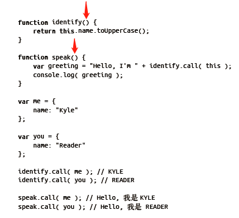
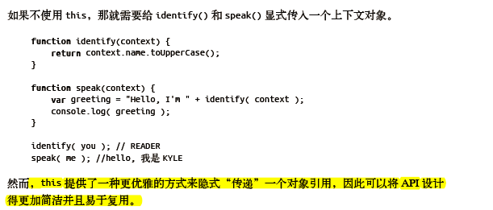

# Why use this?





# this并不一定指向自身

``

```js
var foo = a => {
    console.log(a)
}
foo(2)
function foo1(num) {
    console.log("foo1: " + num);
    this.count++;
}
foo1.count = 0;
var i = 3;
foo1(i)
console.log(foo1.count) //0 count 不应该输出3吗？

function foo2(num) {
    console.log('foo2: ' + num)
    foo2.count++;
}
foo2(4)
foo2.count = 0
foo2(4)
foo2(4)
console.log(foo2.count) // 2


/*
*   使用call (..) 确保this指向函数对象foo本身
* */
for(var i=0; i<10; i++) {
    if(i>5) {
        foo2.call(foo2, i)
    }
}
console.log(foo2.count) // 2 + 4 = 6

```

# this的作用域-两大误区

**1、this 并不指向函数本身**

如果要使得函数可以引用本身有两种方法

1）使用函数命名标识符替代this来引用函数对象

```js
function foo () {
    foo.count++;
}
foo.count = 0;
foo();
```

2）强制this指向函数本身

```js
// 使用call 函数
foo.call(foo)
```

**2、this在任何情况下都不指向函数的词法作用域**

# 四条绑定规则

## 1、默认绑定

如果函数是直接使用不带任何修饰的函数引用进行调用的则是默认绑定，

**this指向全局对象**

```js
function foo(){console.log(this)}
foo() this默认绑定到全局对象
```

## 2、隐式绑定

```js
function foo2() {
    console.log(this)
    console.log(this.b);
}
var obj = {
    b:2,
    foo:foo2
}
obj.foo()
```

**隐式丢失**

1、函数引用

bar是对obj.foo的一个引用，引用的是foo函数本身，bar()是一个不带任何修饰的函数调用，所以为默认绑定

```JS
function foo() {
console.log( this.a );
}
var obj = {
a: 2,
foo: foo
};
var bar = obj.foo; // 函数别名！
var a = "oops, global"; // a 是全局对象的属性
bar(); // "oops, global"
```

2、函数传参

参数传递其实就是一种隐式赋值，因此我们传入函数时也会被隐式赋值

```js
function foo() {
console.log( this.a );
}
function doFoo(fn) {
// fn 其实引用的是foo
fn(); // <-- 调用位置！
}
var obj = {
a: 2,
foo: foo
};
var a = "oops, global"; // a 是全局对象的属性
doFoo( obj.foo ); // "oops, global"
```

2、回调函数丢失this 绑定是非常常见的

如传给setTimeOut

```js
function foo() {
console.log( this.a );
}
var obj = {
a: 2,
foo: foo
};
var a = "oops, global"; // a 是全局对象的属性
setTimeout( obj.foo, 100 ); // "oops, global"

//等价于如下实现
function setTimeout(fn,delay) {
// 等待delay 毫秒
fn(); // <-- 调用位置！
}
```


## 3、显示绑定

**apply() & call()**

```js
function foo() {
console.log( this.a );
}
var obj = {
a:2
};
foo.call( obj ); // 2
```

解决丢失绑定问题

**1)硬绑定**

```js
function foo() {
console.log( this.a );
}
var obj = {
a:2
};
var bar = function() {
foo.call( obj );
};
bar(); // 2
setTimeout( bar, 100 ); // 2
bar.call( window ); // 2
```

**硬绑定的应用场景:**

1、创建一个包裹函数，传入所有参数并返回接受到的所有值

```js
function foo(something) {
console.log( this.a, something );
return this.a + something;
}
var obj = {
a:2
};
var bar = function() {
return foo.apply( obj, arguments );
};
var b = bar( 3 ); // 2 3
console.log( b ); // 5

```

2、另一种使用方法是创建一个bind 可以重复使用的辅助函数：


```js

function foo(something) {
console.log( this.a, something );
return this.a + something;
}
// 简单的辅助绑定函数
function bind(fn, obj) {
return function() {
return fn.apply( obj, arguments );
};
}
var obj = {
a:2
};
var bar = bind( foo, obj );
var b = bar( 3 ); // 2 3
console.log( b ); // 5
```

3、内置函数提供了 **上下文**参数

```
/*
*   1 hello
    2 hello
    3 hello
* */
function foo(el) {
    console.log(el, this.id)
}
var obj = {
    id: "hello"
}
var c = [1,2,3]
c.forEach(foo,obj);
```

## 4、new 绑定

使用new 来调用函数，或者说发生构造函数调用时，会自动执行下面的操作。
1. 创建（或者说构造）一个全新的对象。
2. 这个新对象会被执行[[ 原型]] 连接。
3. 这个新对象会绑定到函数调用的this。
4. 如果函数没有返回其他对象，那么new 表达式中的函数调用会自动返回这个新对象。

**使用new 来调用函数的时候，会构造一个新对象并把它绑定到函数调用中的this上 此时this指向新对象。**

```js
function foo(a) {
    this.a = a;
}
var bar = new foo(2);
bar.a // 2
```


# 判断this

1. 函数是否在new 中调用（new 绑定）？如果是的话this 绑定的是新创建的对象。
var bar = new foo()
2. 函数是否通过call、apply（显式绑定）或者硬绑定调用？如果是的话，this 绑定的是
指定的对象。
var bar = foo.call(obj2)
3. 函数是否在某个上下文对象中调用（隐式绑定）？如果是的话，this 绑定的是那个上
下文对象。
var bar = obj1.foo()
4. 如果都不是的话，使用默认绑定。如果在严格模式下，就绑定到undefined，否则绑定到
全局对象。
var bar = foo()

# 软绑定

硬绑定后无法使用隐式绑定或者显示绑定来修改this

```js
if (!Function.prototype.softBind) {
Function.prototype.softBind = function(obj) {
var fn = this;
// 捕获所有 curried 参数
var curried = [].slice.call( arguments, 1 );
var bound = function() {
return fn.apply(
(!this || this === (window || global)) ?
obj : this
curried.concat.apply( curried, arguments )
);
};
bound.prototype = Object.create( fn.prototype );
return bound;
};
}
```


```js
function foo() {
console.log("name: " + this.name);
}
var obj = { name: "obj" },
obj2 = { name: "obj2" },
obj3 = { name: "obj3" };
var fooOBJ = foo.softBind( obj );
fooOBJ(); // name: obj
obj2.foo = foo.softBind(obj);
obj2.foo(); // name: obj2 <---- 看！！！
fooOBJ.call( obj3 ); // name: obj3 <---- 看！
setTimeout( obj2.foo, 10 );
// name: obj <---- 应用了软绑定
```

# 箭头函数的this

箭头函数不使用this的四种标准规则，而是根据外层(函数或者全局)作用域来决定this

```js
function foo() {
    return (a) => {
        console.log(this.a);
    }
}
var obj1 = {
    a:2
};
var obj2 = {
    a:3
}
var bar = foo.call(obj1)
bar() //2
bar.call(obj2) //2
```

foo() 内部创建的箭头函数会捕获调用时foo() 的this。由于foo() 的this 绑定到obj1， bar（引用箭头函数）的this 也会绑定到obj1.

**箭头函数的绑定无法被修改**


# 小结

如果要判断一个运行中函数的this 绑定，就需要找到这个函数的直接调用位置。找到之后
就可以顺序应用下面这四条规则来判断this 的绑定对象。
1. 由new 调用？绑定到新创建的对象。
2. 由call 或者apply（或者bind）调用？绑定到指定的对象。
3. 由上下文对象调用？绑定到那个上下文对象。
4. 默认：在严格模式下绑定到undefined，否则绑定到全局对象。

一定要注意，有些调用可能在无意中使用默认绑定规则。如果想“更安全”地忽略this 绑定，你可以使用一个DMZ 对象，比如ø = Object.create(null)，以保护全局对象。
ES6 中的箭头函数并不会使用四条标准的绑定规则，而是根据当前的词法作用域来决定this，具体来说，箭头函数会继承外层函数调用的this 绑定（无论this 绑定到什么）。这其实和ES6 之前代码中的self = this 机制一样。